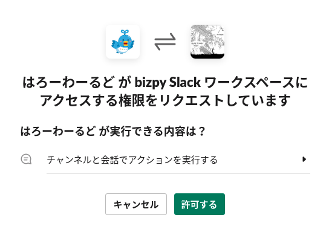

# Slack のインテグレーション

[An introduction to the Slack platform](https://api.slack.com/start/overview) によると、Slack を拡張する方法として2つのやり方がある。

* ワークフロー
  * プログラミングする必要がない
* Slack API を使って Slack apps を開発する
  * プログラミングする必要がある

## ワークフロービルダー

slack クライントでワークフローを作成するためのツール。
次のドキュメントを読み進めながらチュートリアルをこなせば簡単に作成できる。

* [ワークフロービルダーガイド](https://slack.com/intl/ja-jp/help/articles/360035692513-%E3%83%AF%E3%83%BC%E3%82%AF%E3%83%95%E3%83%AD%E3%83%BC%E3%83%93%E3%83%AB%E3%83%80%E3%83%BC%E3%82%AC%E3%82%A4%E3%83%89)

残念ながらこの機能は有料プランでのみ利用できる。
BizPy ワークスペースはフリープランで使っているのでワークフロービルダーは使えない。

有料プランで運用している Slack ワークスペースでデモだけやります。
デモで利用するサンプルのワークフローを作成したワークフロービルダーの画面は次になります。

### ワークフロービルダーを起動する


### ワークフロービルダーで作成したワークフロー一覧


### ショートカットからワークフローを選択する


### サードパーティーのステップを利用する

Slack 社が提供している [Google Sheets for Workflow Builder](https://slack.com/app-pages/google-sheets) を使うと簡単に Google Sheets を扱うステップを追加できる。


## Slack apps

自分でプログラムを書いて Slack API を使ってカスタムアプリケーションを作成する仕組み。ドキュメントは次になる。

* https://api.slack.com/start/building

サイドバーをみてたら [日本語ページ](https://api.slack.com/lang/ja-jp) もあった。初心者はここから読み進める方が簡単かもしれない。

### OAuth について少し

ある操作をユーザーに許可するときに2つのやり方がある。

* 認証 (Authentication): 相手が誰かを確認すること
  * HTTP では失敗すると 401 Unauthorized が返る


* 認可 (Authorization): リソースへのアクセス権限を確認すること
  * HTTP では失敗すると 403 Forbidden が返る


日本語も英語も似ている言葉なのでややこしいが、権限やリソース管理においてこの2つは明確に異なるので意識して使い分けるようにするとよい。ちなみに OAuth は認可 (Authorization) の仕組みを標準化したもの。

認可の要点は次になる。セキュリティは認証よりは落ちるが、実運用におけるサービスの利便性が向上する。

* サービス側はアクセスするごとに相手を認証しなくてよい
  * (注意) トークンを知っていれば誰でもアクセスできる
* パスワードをアプリケーションに教えなくてよい
  * 不特定多数のサービスで個別にトークンを設定できる

### 簡単な bot アプリの開発

Slack App マネージメントで新規アプリを作成する。


好みでアプリ設定していく。

- アプリの名前
- アプリをインストールするワークスペース

後で bolt アプリの起動時に必要になるので `Signing Secret` という署名用のトークンをエディターにメモしておく。


OAuth & Permissions の画面を開く。

Scopes のフォームで次の OAuth Scope を追加する。

 - app_mentions:read
 - chat:write

もし Bots の設定が有効になっていなければ App Home の画面で設定を見直して有効にする。

試しにワークスペースに Slack apps をインストールしてみる。



`Bot User OAuth Token` が生成されるのでこのトークンもエディターにメモしておく。

ローカルマシンの端末で bolt アプリケーションを開発する。

事前にエディターにメモしておいた2つのトークンを環境変数として設定する。bolt フレームワークは自動的にこれらの環境変数を読み込んでくれる。

```bash
$ export SLACK_SIGNING_SECRET=***
$ export SLACK_BOT_TOKEN=xoxb-***
```

ひとまず bolt アプリケーションは次のようなコードでよい。デフォルトのパスは `localhost:3000/slack/events` となる。

```python
import logging
logging.basicConfig(level=logging.DEBUG)

from slack_bolt import App

app = App()

if __name__ == '__main__':
    # POST http://localhost:3000/slack/events
    app.start(port=3000, path='/slack/events')
```

[ngrok](https://ngrok.com/) を使ってインターネットからアクセス可能にする。

```bash
$ ngrok http 3000
```

Slack App マネージメントに戻り、Event Subscriptions の画面を開く。

- Enable Events を On にする
- Request URL に次を設定する

> https://973a-160-86-243-196.ngrok.io/slack/events

すぐにリクエストされて Verified がつくはず。

Subscribe to bot events のフォームで `app_mention` のイベントを設定する。


イベントを追加すると自動的に必要なスコープが OAuth 権限に追加される。

最後に *Save Changes* ボタンで保存する。OAuth の権限に変更がある場合、次のようなメッセージがヘッダーに表示される。

> You’ve changed the permission scopes your app uses. Please reinstall your app for these changes to take effect (and if your app is listed in the Slack App Directory, you’ll need to resubmit it as well).

言われた通り、アプリを再インストールする。

slack client 上で bot を招待した適当なチャンネルで作成した slack apps にメンションする。

> @BizPy Bot こんにちはー


ここまで動くまでに行った設定は次になる。


ここまでの設定とシステム構成は次のようになる。


### bot アプリに他のイベントのハンドラーを追加する

Slack App マネージメントの Event Subscriptions の画面を開き、購読するイベントに `message.channels` を追加してみる。メンションしない普通のメッセージを投稿してみる。

イベントを listen してなければ次のようなログが表示される。

```python
[Suggestion] You can handle this type of event with the following listener function:

@app.event("message")
def handle_message_events(body, logger):
    logger.info(body)
```

イベントの種別 (type) をみて処理をわけるとかやってみる。

### 一時的なインターネットとの通信に ngrok (エングロック) を使う

ローカル環境の開発サーバーをインターネットからアクセスできるようにするサービスとして [ngrok](https://ngrok.com/) があります。勉強会のデモなど一時的な用途で使うときにとても便利です。

通信を仲介する機能をもったアプリケーションをプロキシ (Proxy) と呼んだり、ある地点とある地点の2点間を仮想的に結ぶことをトンネリング (tunneling) と呼んだりします。ngrok はプロキシサービスとか、トンネリングサービスとかどちらの言葉でも呼ばれるかもしれません。

インターネットからアクセス可能なサーバーを構築するのは少し手間がかかります。たいていはクラウドプラットフォームやプロバイダサービスを利用する必要があります。

* グローバル IP アドレスの取得
  * インターネット上から一意にアクセスできる IP アドレスが必要
* アプリケーションのデプロイ
  * グローバル IP アドレスをもつサーバーにデプロイしないといけない

例えば、AWS で パブリック IP アドレスをもつ ec2 インスタンスを起動してセキュリティグループの設定を行い、その ec2 インスタンスにアプリケーションをデプロイします。

一方でインターネット上にサーバーを公開するときはセキュリティを考慮しないと攻撃を受けたり、サーバーを乗っ取られて攻撃の踏み台に使われたりする可能性があるのと注意が必要です。サーバー運用やセキュリティに一定の知識をもった上で作業しましょう。
