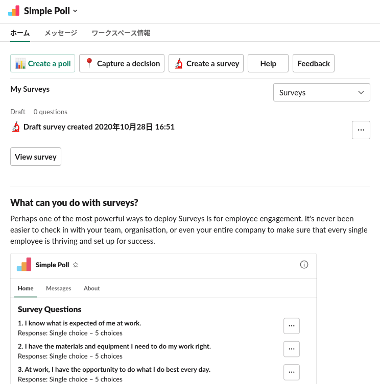
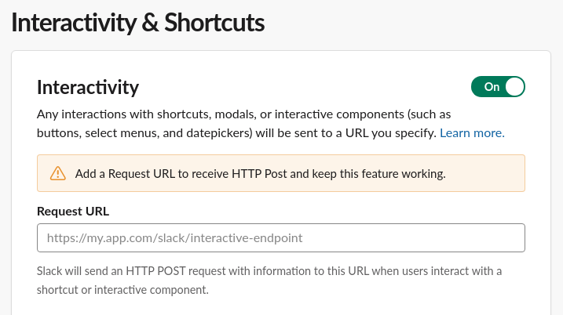

# Slack apps のホーム画面と Block Kit の紹介

[前回の bot アプリ](https://github.com/t2y/python-study/tree/master/BizPy/slack/20211027) の続きから進めます。

[新機能、アプリのホーム・ヴューを活用しよう🏡](https://api.slack.com/lang/ja-jp/app-home-with-modal) のチュートリアルをみながら実際にホーム画面の設定やモーダル画面の作成をやってみます。[Block Kit](https://api.slack.com/block-kit) は Slack apps の UI フレームワークを使って画面を作れます。

例えば、[Simple Poll](https://kazamori.slack.com/apps/A0HFW7MR6-simple-poll) というアンケートアプリのホーム画面は次になります。



## ホーム画面を追加する

ホーム画面を追加するには Slack App マネージメントで次のように設定します。

1. App Home で `Home Tab` を有効にして再インストールする

この時点で Slack apps のアプリのタブに「ホーム」が追加されるのを確認できる。但し、画面の設定がないので何も表示されない。


## 必要なスコープの追加とイベントを購読する

ホーム画面を作るためにスコープ (権限) 追加やイベントの購読をしていきます。

1. OAuth & Permissions で `OAuth スコープ` に `chat.write` を追加する
1. Event Subscriptions で 購読するイベントに `app_home_opened` を追加して変更を保存する

slack client 上で bot アプリのホームタブを開くと、bot アプリに `app_home_opened` イベントが届くようになる。bot アプリがこのイベントを listen してなければ次のようなログが表示される。

```python
[Suggestion] You can handle this type of event with the following listener function:

@app.event("app_home_opened")
def handle_app_home_opened_events(body, logger):
    logger.info(body)
```


## ホーム画面でインタラクティブな操作を行う

ホーム画面でボタンやモーダル画面を設置して、ユーザーがボタンをクリックしたり、フォームに入力した情報を受け取れるようにする。

1.  Interactivity & Shortcuts で Interactivity を有効にする

Request URL にインタラクティブな操作 (アクション) をしたときのリクエストを受け付ける URL を設定する。いまアクションを受け付ける bot アプリとイベントハンドラーの bot アプリは同じ bolt アプリケーションのソースコードにあるので Event Subscriptions で設定した Request URL と同じ URL を設定する。

```
https://somewhere.ngrok.io/slack/events
```



後述する画面でインタラクティブな操作を行うと、アクションのイベントが届くようになる。bolt アプリケーションのソースコードがそのアクションのイベントハンドラーを実装していないと次のようなログが出力される。

`@app.event("app_home_opened")` ではなく `@app.action("my_buton_click")` のようにデコレーションに実装する以外はイベントハンドラーとほとんど同じにみえる。

```python
[Suggestion] You can handle this type of event with the following listener function:

@app.action("my_buton_click")
def handle_some_action(ack, body, logger):
    ack()
    logger.info(body)
```

## Block Kit を使ってホーム画面を設定する

[Block Kit](https://api.slack.com/block-kit) の設定は JSON で行える。Block Kit Builder を使うと、GUI でぽちぽちしながらブロックを組み合わせて画面とその JSON のペイロードを確認できる。この内容をみながらプロトタイプを作って、bolt アプリケーションに実装していくとよさそう。

https://app.slack.com/block-kit-builder/TM8Q18RHT#%7B%22type%22:%22home%22,%22blocks%22:%5B%7B%22type%22:%22section%22,%22text%22:%7B%22type%22:%22mrkdwn%22,%22text%22:%22*Welcome!*%20%5CnThis%20is%20a%20home%20for%20Stickers%20app.%20You%20can%20add%20small%20notes%20here!%22%7D,%22accessory%22:%7B%22type%22:%22button%22,%22action_id%22:%22add_note%22,%22text%22:%7B%22type%22:%22plain_text%22,%22text%22:%22Add%20a%20Stickie%22%7D%7D%7D,%7B%22type%22:%22divider%22%7D%5D%7D

例えば、ホーム画面を設定するときは `client.views_publish()` に Block Kit の JSON ペイロードとなる設定を渡せばよい。Block Kit の設定内容はソースコードを参照。

```python
@app.event('app_home_opened')
def handle_app_home_opened_events(client, event, body, logger):
    logger.info(pformat(body))
    client.views_publish(user_id=event['user'], view=_HOME_VIEW)
```


ボタンのアクションに対応するイベントハンドラーを実装する。ここではイベントを受け取ったことを `ack()` で返信してログ出力しているだけになる。`ack()` を返さないと Slack 側はイベントが届いたかどうかわからないのでリトライで同じイベントが届くようになるので何もしなくても `ack()` は返さないといけない。

```python
@app.action('my_buton_click')
def handle_click_button(ack, body, logger):
    ack()
    logger.info(pformat(body))
```

## モーダル画面を作ってみる

ホーム画面とほとんど同じ要領でモーダル画面のアクション、そのモーダル画面で操作したときのビューに対応するイベントハンドラーを実装することでインタラクティブな操作を制御できる。ソースコードをみながら説明する。

ホーム画面にモーダル画面を開くボタンを追加する。


モーダル画面を開いたところ。


## デバッグ出力の整形

[pprint](https://docs.python.org/ja/3/library/pprint.html) を使ってログをみやすく整形する。
ディクショナリを整形したかったら pformat を使うというやり方もある。

## bolt サーバーの自動再起動

bolt アプリケーションのソースコードを変更する度に手動でプロセスを再起動しないといけない。bolt-python の issues にも登録されていたが、現時点ではよい方法はないらしい。

* https://github.com/slackapi/bolt-python/issues/390

試しに watchdog の watchmedo という CLI を使ってみたが、 socketserver モジュールでエラーになるので無理そう。

```bash
$ watchmedo shell-command --pattern="*.py" --command='python "${watch_src_path}"' .
```

```
    self.server_bind()
  File "/usr/lib/python3.8/http/server.py", line 138, in server_bind
    socketserver.TCPServer.server_bind(self)
  File "/usr/lib/python3.8/socketserver.py", line 466, in server_bind
    self.socket.bind(self.server_address)
OSError: [Errno 98] Address already in use
```