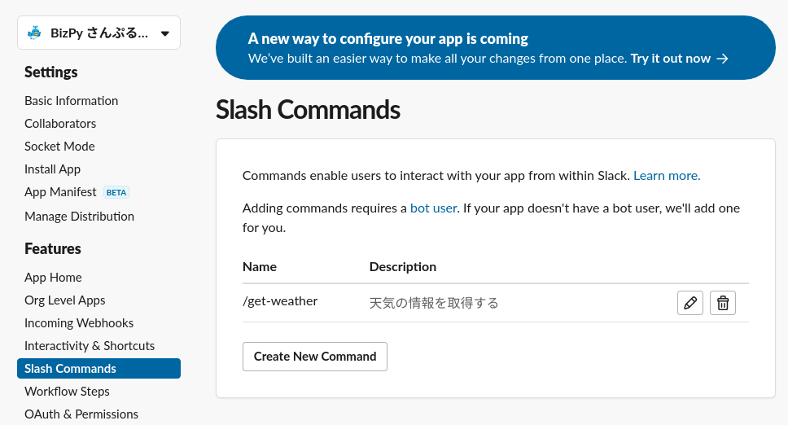
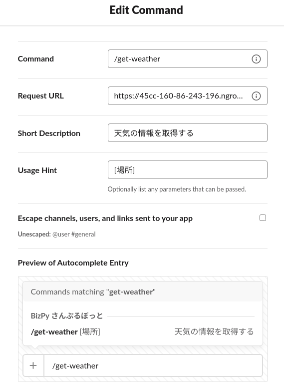
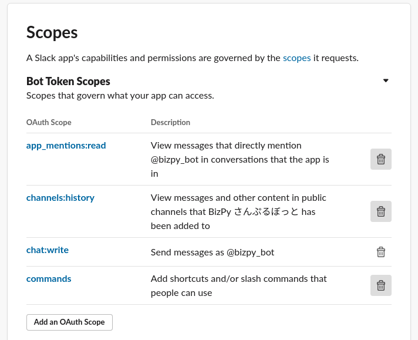
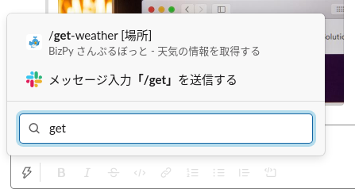
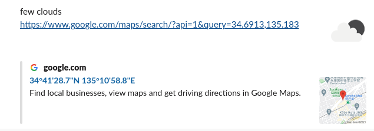

# Block Kit を使った Slack apps の紹介

[前回の bot アプリ](https://github.com/t2y/python-study/tree/master/BizPy/slack/20211110) の続きから進めます。次のチュートリアルの内容を参考にしながらこれまで実装していない機能を作っていきます。

* [Block Kit を使ってより情報的なレストラン検索コマンドを作ろう](https://api.slack.com/lang/ja-jp/slash-block-kit)
* [Block Kit で経費承認アプリをデザインする](https://api.slack.com/lang/ja-jp/design-expense-block-kit)

## スラッシュコマンドを作る

Slack で特定アクションのショートカットとして [スラッシュコマンド](https://slack.com/intl/ja-jp/help/articles/201259356-Slack-%E3%81%AE%E3%82%B9%E3%83%A9%E3%83%83%E3%82%B7%E3%83%A5%E3%82%B3%E3%83%9E%E3%83%B3%E3%83%89) があります。ドキュメントによると次の3つの種別があります。

* Slack が提供している組み込みのスラッシュコマンド
* 開発者が作成したアプリのスラッシュコマンド
* オーガナイゼーションのメンバーが作成したカスタムスラッシュコマンド

たとえば、組み込みのスラッシュコマンドの例として次のように入力して実行するとチャンネルのトピックを変更できます。

```
/topic トピック
```

また bot アプリが提供するスラッシュコマンドは2番目の種別になります。

### スラッシュコマンドを設定する

Slack apps の管理画面から Slash Commands の画面を開き、新しいコマンドを作成する。



コマンドの編集画面は次になります。



Request URL にスラッシュコマンドを実行したときのリクエストを受け付ける URL を設定します。これまでイベントの購読やアクションのリクエストなどで登録してきたのと同様にイベントハンドラーを実装するためのエンドポイントとなります。

これまでと同様、bolt アプリケーションでスラッシュコマンドを実装するため、Event Subscriptions で設定した Request URL と同じ URL を設定します。

```
https://somewhere.ngrok.io/slack/events
```

`@app.event("app_home_opened")` ではなく `@app.command("/get-weather")` のようにデコレーターを実装する以外はイベントハンドラーとほとんど同じにみえます。

```python
[Suggestion] You can handle this type of event with the following listener function:

@app.command("/get-weather")
def handle_some_command(ack, body, logger):
    ack()
    logger.info(body)
```

### 権限の確認

スラッシュコマンドを追加すると OAuth Scope に `commands` という権限が自動的に追加されます。OAuth & Permissions の画面を開いて確認しておきましょう。



ショートカットの UI から `/get` と入力すると、作成したスラッシュコマンドが表示されるのを確認します。



### 本人だけみえるメッセージを返信する

ここでは bolt-pythn の [respond](https://slack.dev/bolt-python/concepts#action-respond) というユーティリティを使ってスラッシュコマンドに返信します。`response_type` というパラメーターで返信内容をどのように扱うかを設定できます。

* in_channel: チャンネルの参加者全員がみえる (普通のメッセージ)
* ephemeral: 本人だけみえるメッセージ

```python
    respond(
        response_type='ephemeral',
        blocks=[{
            ...
        }]
    )
```

`blocks` に前回学んだ [Block Kit](https://api.slack.com/block-kit) の JSON を記述することで簡単に UI コンポーネントを使えます。

## bot アプリから外部サービスの web api を呼び出す

[OpenWeather](https://openweathermap.org/) という世界の天気の情報を扱うサービスを利用します。機能制限はありますが、いくつかの web api は無料で利用できます。

[Current weather data](https://openweathermap.org/current) という web api を呼び出してみます。名前の通り、現在の天気の情報を返します。

* リクエスト例

```bash
$ curl -s "https://api.openweathermap.org/data/2.5/weather?appid=$OPEN_WHEATHER_API_KEY&q=Kobe" | jq .
```

* レスポンス

```json
{
  "coord": {
    "lon": 135.183,
    "lat": 34.6913
  },
  "weather": [
    {
      "id": 804,
      "main": "Clouds",
      "description": "overcast clouds",
      "icon": "04n"
    }
  ],
  "base": "stations",
  "main": {
    "temp": 285.87,
    "feels_like": 285.81,
    "temp_min": 284.87,
    "temp_max": 286.97,
    "pressure": 1000,
    "humidity": 100
  },
  "visibility": 10000,
  "wind": {
    "speed": 0.45,
    "deg": 202,
    "gust": 1.34
  },
  "clouds": {
    "all": 100
  },
  "dt": 1638297264,
  "sys": {
    "type": 2,
    "id": 19913,
    "country": "JP",
    "sunrise": 1638308885,
    "sunset": 1638344922
  },
  "timezone": 32400,
  "id": 1859171,
  "name": "Kobe",
  "cod": 200
}
```

[Weather Conditions](https://openweathermap.org/weather-conditions) によると、アイコン情報を使って次のような URL にアクセスすると、天気のアイコンを取得できます。

例えば、雷雨のアイコンは次になります。`@2x`, `@4x` のように指定するとアイコンサイズを変更できます。

* https://openweathermap.org/img/wn/11d@4x.png

## Block Kit UI を使って天気の情報をチャンネルに書き込む

先ほどの OpenWeather の web api を使って指定した場所の現在の天気を取得してみましょう。

1. スラッシュコマンドを実行する
1. モーダル画面を開く
1. ユーザーが場所と日付を入力する
1. OpenWeather の web api を呼び出す
1. チャットにレスポンスを書き込む



サンプルのソースコードを読みながら1つずつみていきましょう。

### モーダル画面を使うときの注意事項

[Don't rely on response_url](https://api.slack.com/block-kit/dialogs-to-modals#responding) によると、モーダル画面を扱うときにそのイベントハンドラーには `response_url` というパラメーターが渡されません。この値が設定されていないと、先ほどの `respond` のユーティリティなども使えません。

ドキュメントによると、[private_metadata](https://api.slack.com/surfaces/modals/using#private_metadata) というパラメーターを使ってビュー間のデータの受け渡しをするとよいそうです。

`response_url` の扱いについては Slack 社のせらさんが詳細な解説記事を書いています。こちらも参考にするとよいです。

* [Slack ペイロードに含まれる response_url を完全に理解する](https://qiita.com/seratch/items/ed29acd565af36e65072)

https://twitter.com/seratch_ja/status/1464942624935059463 によると、`client.chat_postMessage()` でチャンネルに書き込むのではなく、`response_url` を使って `respond` で書き込むのでは次の違いがあるそうです。

* OAuth Scope に `chat:write` の権限を必要としない
* `response_url` には有効期限がある

